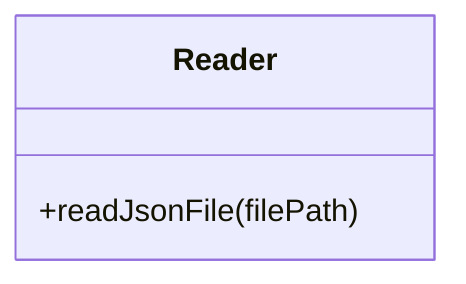
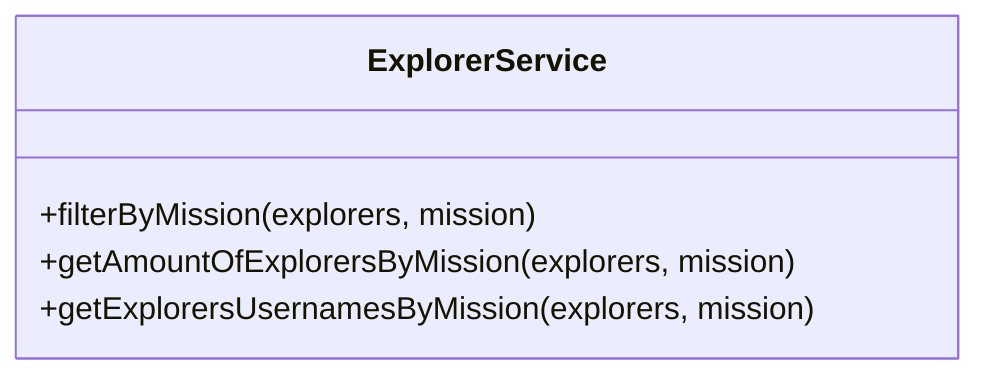
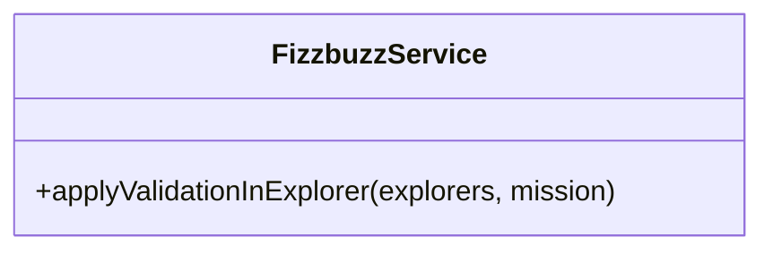

# Fizzbuzz
*Practica 1 de la semana 4 en LaunchX | Refactorización de código*

Para esta practica se tomo un proyecto ya comenzado con los siguientes requerimientos:

## Requerimientos:

    Refactorizar el script legado y rehacerlo con mucho cuidado ya que es información muy sensible.
    Crea un API para usar la funcionalidad anterior:

## Dependencias:
  * Jest
  * Eslint
  * Express
  * telegram-bot-api
  * dotenv

## Resumen:
  * Se crearon tres clases: Reader, ExplorerService usando POO, FizzbuzzService para modularizar el proyecto y este más optimizado.

## Github Actions y Linter

Como punto final se uso github actions para automatizar la ejecucion de pruebas en cada push y se uso linter para la correccion de estilos y limpieza de codigo.
